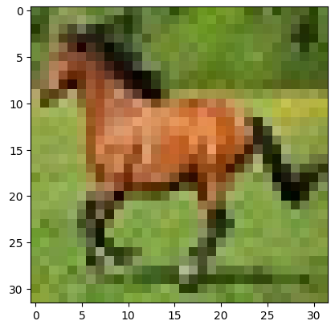

# Ruben_Hedstrom_Portfolio
Portfolio

# [Snake game using Reinforcement learning](https://github.com/rubenhed/Python/tree/main/Snake_RL)
* notes1
* notes2
* notes3...

 

# [Image Classifier](https://github.com/rubenhed/Python/tree/main/Image_Classifier)
* notes1
* notes2
* notes3...

# [Computerized Tomography learning game](https://github.com/rubenhed/Python/tree/main/CT_image_learning_game)
* notes1
* notes2
* notes3...

# [Shellsort sorting algorithm](https://github.com/rubenhed/C/tree/main/Shellsort_sorting_algorithm)
* notes1
* notes2
* notes3...

# [Movie Database](https://github.com/rubenhed/Java/tree/main/Movie_Database)
* notes1
* notes2
* notes3...

