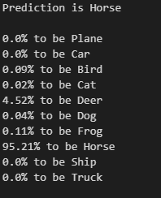

# Ruben_Hedstrom_Portfolio
Below are projects done in Python, C and Java. [Here](Courses.pdf) are courses taken in University.

# [Snake game using Reinforcement learning](https://github.com/rubenhed/Python/tree/main/Snake_RL)
* Reinforcement learning algorithm that learns to play the game snake from zero.
* Hobby project built in Python.
* Main libraries used: Pygame, PyTorch, NumPy.

 

# [Image Classifier](https://github.com/rubenhed/Python/tree/main/Image_Classifier)
* Deep learning algorithm using image data to learn to identify certain animals and vehicles.
* Hobby project built in Python.
* Main libraries used: TensorFlow, Keras, NumPy.

 

# [Computerized Tomography learning game](https://github.com/rubenhed/Python/tree/main/CT_image_learning_game)
* Learning game aimed for medicine students to learn to identify anomalies in CT-images. 
* In progress.
* Todo: user-friendly interface and more functions(full screen mode, different game modes, etc.)
* University project built in Python
* Main libraries used: Tkinter, PIL, threading, NumPy.

# [Shellsort sorting algorithm](https://github.com/rubenhed/C/tree/main/Shellsort_sorting_algorithm)
* Sorting algorithm to sort lists, optimized using multi-threading and optimization flags.
* University project built in C
* Main libraries used: OpenMP, stdio, stdlib.

# [Movie Database](https://github.com/rubenhed/Java/tree/main/Movie_Database)
* A local database that lets the user add and score new movies, and search for movies based on name and score. 
* University project built in Java

